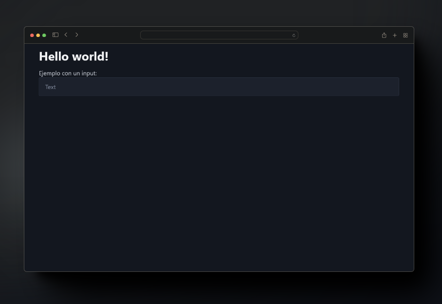

---

title: "Cómo integrar Pico.css en un proyecto de Nuxt 3"
date: 2024-02-26
tags: [vue, css, web]
---

###

#### **Introducción**
En este artículo, explico cómo agregar **Pico.css** a un proyecto de **Nuxt 3**. Tras buscar sin éxito una guía clara, decidí documentar mi solución por si es útil para otros. El proceso es sencillo y rápido.

> **Nota**: Asumo que ya tienes un proyecto de Nuxt 3 creado. Si no, sigue la [documentación oficial](https://nuxt.com/docs/getting-started/installation) y ejecuta:
> ```bash
> npx nuxi@latest init <project-name>
> ```
> *(Requiere Node.js v18.0.0 o superior)*


#### **1. Instalar Pico.css**
A. Visita la [página oficial de Pico.css](https://picocss.com/) y dirígete a la sección **"Getting Started"**.
B. Elige el comando de instalación según tu gestor de paquetes (npm, yarn, pnpm). Por ejemplo:
   ```bash
   npm install @picocss/pico
   ```
C. Verifica la instalación en tu `package.json`:
   ```json
   {
     "dependencies": {
       "@picocss/pico": "^2.0.3"
     }
   }
   ```


#### **2. Configurar Pico.css en Nuxt 3**
A. **Crea un archivo CSS**:
   Dentro de la raíz del proyecto, crea la siguiente estructura:
   ```bash
   assets/css/app.css
   ```
B. **Importa Pico.css**:
   Abre `app.css` y agrega el siguiente código para importar el archivo CSS desde `node_modules`:
   ```css
   @import url("@picocss/pico/css/pico.css");
   ```

C. **Inicia el proyecto**:
   Ejecuta el servidor de desarrollo (ejemplo con `pnpm`):
   ```bash
   pnpm run dev
   ```
   Pico.css ya estará aplicado a tu proyecto.


#### **Resultado**
Al iniciar la aplicación, verás los estilos de Pico.css aplicados automáticamente:



---
**Conclusión**: Con estos pasos, tendrás Pico.css integrado en tu proyecto de Nuxt 3 de manera rápida y sin complicaciones. ¡Espero que te sea útil!
